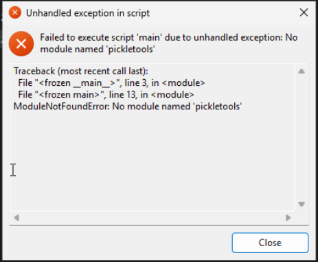

# Vocara: Privacy-First Local Dictation



Vocara is a blazing-fast, privacy-first local dictation application powered by Whisper. Everything runs entirely on your own hardware, guaranteeing absolute privacy and zero latency from network requests.

## Features
- **Local AI Transcription**: Powered by robust machine learning models running locally.
- **Always-On VAD Mode**: Automatically detects speech, transcribes, and types it for you.
- **Push-to-Talk**: Hold a hotkey to record and release to transcribe instantly.
- **Cross-Platform**: Seamless support across Linux and Windows.
- **Sleek UI**: Minimalist, unobtrusive user interface that sits quietly in your tray or screen corner.

## Prerequisites
- **Python 3.10+**
- **Hardware**: A dedicated GPU is highly recommended for optimal transcription speed, but it can run on CPU with a slightly higher latency.

## Installation

### Linux
1. Clone the repository.
2. Run the included setup script:
   ```bash
   chmod +x install.sh
   ./install.sh
   ```
3. Launch Vocara using `python main.py` or compile it with PyInstaller.

### Windows
1. Clone the repository.
2. Install the requirements:
   ```cmd
   pip install -r requirements.txt
   ```
3. Run the application:
   ```cmd
   python main.py
   ```

## Compiling from Source
To create a standalone executable, you can use PyInstaller:
```bash
pyinstaller --onefile --windowed --name Vocara --icon=assets/icon.ico --add-data "assets:assets" main.py
```

## Privacy First
Vocara does not send your voice data to the cloud. All audio processing and transcription happen right on your local machine.
