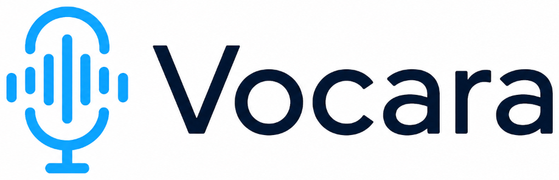

# Vocara: Privacy-First Local Voice Dictation

<p align="center">
  
</p>

Vocara is a blazing-fast, privacy-first local dictation application powered by modern Whisper models. Everything runs entirely on your local hardware, guaranteeing absolute privacy and zero latency from external cloud networks.

## Features

- **Upgraded Whisper Engine**: Powered by `faster-whisper` (CTranslate2) delivering up to 4x faster transcription speed with int8/float16 quantization, with automatic fallback support for `openai-whisper`.
- **Next-Gen Model Support**: Includes native support for **`turbo` (`large-v3-turbo`)**, `base`, `tiny`, `small`, `medium`, and `large-v3`.
- **Refined Desktop HUD**: A sleek, dark graphite floating HUD bar with real-time VU audio metering, active state indicators, and quick controls.
- **Dynamic Vocabulary & Jargon**: Add custom technical terminology, acronyms, and unique names that are dynamically injected into Whisper's prompt for pinpoint recognition accuracy.
- **Voice Commands & Smart Editing**: Spoken hotkeys including:
  - `"scratch that"` (deletes last word)
  - `"strike line"` (erases current line)
  - `"undo last"` (Ctrl+Z)
  - `"vocara pause"` / `"vocara resume"`
  - `"open quote" / "close quote"` and `"quote ... unquote"`
  - `"cancel that"` (smart cancellation)
- **Always-On VAD Mode**: Automatically detects speech, transcribes, and types it for you without touching your keyboard.
- **Push-to-Talk & Toggle**: Configurable hotkeys (e.g. Mouse 5, Ctrl+Space).
- **Fullscreen Auto-Suspension**: Automatically pauses always-on listening while gaming or watching movies in fullscreen.
- **Ghost Mode**: Minimize to tray anytime and toggle visibility with `<Ctrl>+<Alt>+V`.

## Prerequisites

- **Python 3.10+**
- **Hardware**: Runs on CPU (blazing-fast with int8 quantized models) and GPU (AMD ROCm / NVIDIA CUDA).

## Installation

### Linux
1. Clone the repository:
   ```bash
   git clone https://github.com/hoodfigga/Vocara.git
   cd Vocara
   ```
2. Run the setup script:
   ```bash
   chmod +x install.sh
   ./install.sh
   ```
3. Launch Vocara:
   ```bash
   python3 main.py
   ```

### Windows
1. Clone the repository:
   ```cmd
   git clone https://github.com/hoodfigga/Vocara.git
   cd Vocara
   ```
2. Run the setup script:
   ```cmd
   install.bat
   ```
   *Or manually install dependencies: `pip install -r requirements.txt`*
3. Launch Vocara:
   ```cmd
   python main.py
   ```

## Privacy & Security
Vocara does not transmit audio or text data to external servers or cloud services. All processing, voice activity detection, and speech-to-text inference execute 100% locally on your machine.
